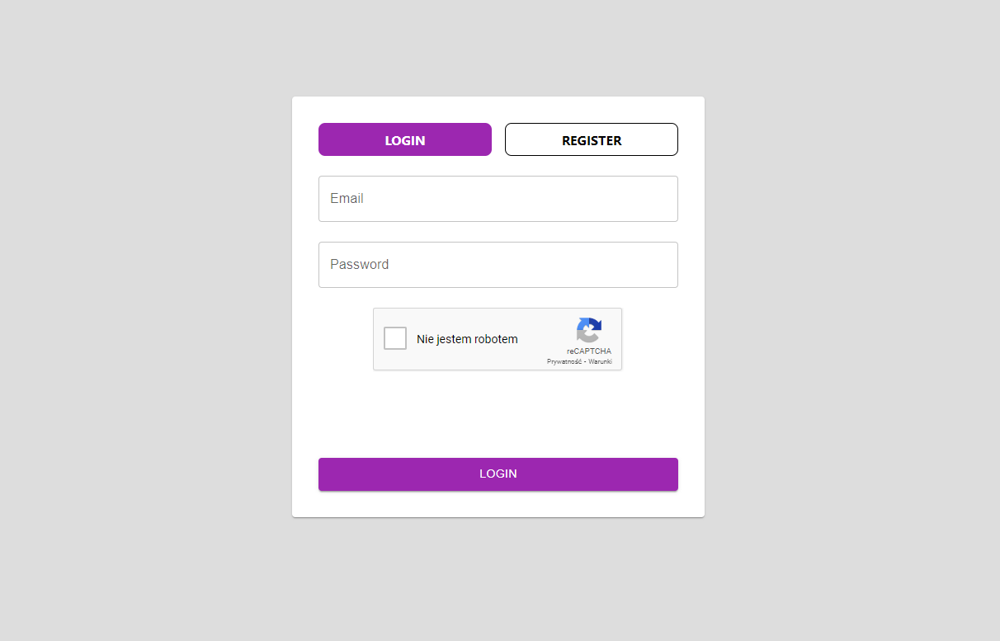
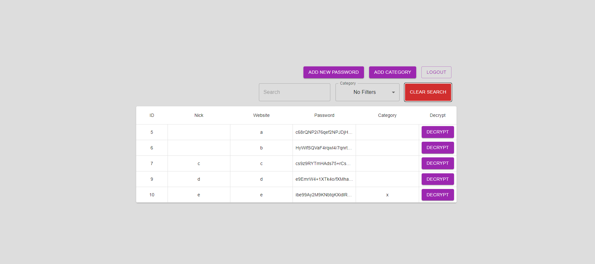

# King-sGuard

KeePass is a free, open-source password manager. It securely stores passwords and sensitive information in an encrypted database, available on Windows, macOS, Linux, Android, and iOS.

## How to run:

### Server

1. Go to the <b>./backend</b> folder and run `symfony server:start`
2. Go to the <b>./backend</b> folder and run `composer install`
3. In second terminal go to the <b>./backend</b> folder and run `docker compose up`

### Client

1. Go to the <b>./frontend</b> folder and run `npm run dev`

Enjoy!

### Screens

1. Login
   

2. Passwords Table
   
